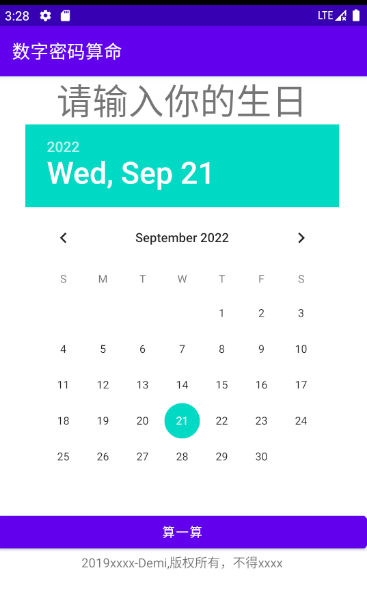
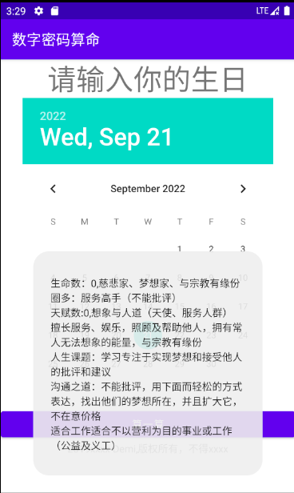
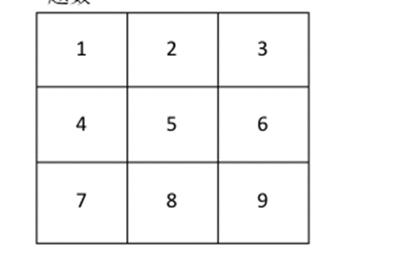

# DEADME

数字密码算命，主界面如下：

仅供娱乐，请不要太多在意

## 数字密码算命测算法

测算方法：

一、先计算天赋数与生命数阳历出生日）

1974年7月3日1+9+7+4+7+3=31（3，1是天赋数, 3+1=4，4是生命数）

1974年7月29日1+9+7+4+7+2+9=39 （3，9是天赋数, 3+9=12，1+2=3，3是生命数）

0是加强，比如天赋数1，0表示决对的天生领导人，生命数为1，那么连起来是101，可查卓越数。

1、 独立、主见、天生领袖、个性较急

圈多：主观意识强，很想成功（不能指挥他）

无圈：无个人主意

2、信任别人、双重性格、在分析、色彩造型、艺术鉴赏、文学方面有优秀表现。 圈多：依赖、有生活品味

无圈：不擅长合作，待他人比待自己好，容易受伤

3、创意、艺术表达力，多愁善感型

圈多：不能批评，理想坚持度高，有创意

无圈沟通能力不好，还原改变

4、组织能力强、稳定

圈多：稳定性高，不易受影响

无圈：易受影响，改变太多

5、爱好自由、口才好、美食家、旅行家、个性开朗

圈多：主动性强，自由，不断变化，爱旅游，爱唱歌，口才好，爱吃

无圈：主动性差，要别人指导与督促，较内向，对爱情缺乏安全感

6、负责、天生有治疗别人的能力，喜欢交朋友

圈多：照顾人群、责任心强

无圈：对他人需求迟钝，要直接讲明白，不太愿意承担责任；

7、好奇心，求知欲强、追求真理

圈多：好奇、质疑、专横

无圈：爱热闹，心胸开放，易相信别人

8、生意、公关、人际开发能力强，最讨厌别人懒惰

圈多：商业头脑、权力欲及公关能力强

无圈：不在乎权势，对钱没概念，不善理财

9、慈悲家、梦想家、与宗教有缘份圈多：服务高手（不能批评）

无圈缺乏爱心、较自私、需要开发想象力

 

 

0、加强前数字的灵性力量，让人有企图心，努力上进，但受阻挫败后容易放弃，变成听天由命

1、独立与创造（主见、领袖自居）

天生的领导人，有本事，喜标新立异，满脑子新点子，总在发掘新事务，比较主观及冲动价值观是非分明

人生课题：学习信任与合作

沟通之道：不能指挥他们做事做决定要咨话题他们，好处要让他们知道，在意价格

适合的工作：有前瞻性，发展性的，旬立作业的工作，如市场开发，国外工作，部门主管，发明家

2、合作与细节（信任别人、擅长分析、双重性格）天生具有敏锐分析及观察允许角力，爱批评、擅指正，具男女双重性格，情感丰富，为人温和亲切，天生依赖

人生课题：学习独立与耐心

沟通之道：喜欢由您做决定，希望得到感激涕零，在意价格

适合的工作：公关职务，协调沟通类型

3、创意与沟通（理想家和艺术家）聪明，天赋异禀的艺术家，充满理想，立于不败之地沟通，学习力强，太理想化，不够实际

人生课题：学习实际与接爱他人的批评和建议

沟通之道：不能批评，在乎别人对他的看法，相信美好的事物，不在意价格

适合工作：可发挥创意的工作，如企划，音乐工作，演艺人员

4、安全感与秩序（称定、踏实，保障）擅长看穿事情真相，有条理给人安全感，业于组织与生产，务实，稳定，可靠，天生缺乏安全感过于顽固，不喜欢改变

人生课题：学习给自己安全感和接受改变

沟通之道：眼见为凭，多讲保障，在意价格

适合工作：组织建构力强的工作：如建筑师，工程师

5、自由与冒险（不爱拘束）拥有演说与促销的天份，崇尚自由及品味，喜欢新奇人生课题：学习承诺与勇气

沟通之道：不要逼上梁山他们做承诺，不能限制和压迫他们，

适合工作：业务性质的工作如业务员，或投身自由职业的工作

6、和谐与助人（勇于承诺和承担责任，照顾他人胜过照顾自己）乐于付出及承担，具有丰富的爱心，勇于分担他人困难拙于面对自己的困难，凡事应量力而为

人生课题：学习拒绝，多爱自己

沟通之道：喜欢肯定和被人需要，不能叫他们怎么做，而请他们协助会取得更大成就，他们会非常乐意，不在乎价格

适合工作：服务性质的工作，如服务业，护士，咨询师

7、分析与真理（爱质疑）直觉敏锐精于研究，调查，寻找事实的真相，能力强，除非百分百的肯定，否则对答案难满意，追求至高无上的真理及精神，多疑，较懒惰

人生课题：学习相信与改变，接受真相

沟通之道：让他们明确知道得到的好处，指出发展潜力，注重形象，开始在乎价格，除非是让其可以在未来获利

适合工作：研究性质的工作，如教授，研发人员

8、权力与开发（天生的生意、公关能力强）天生领导人，善于开发，资质聪明，独具慧眼，具建设力，相信白手起家，善用投机天份坐拥权力

人生课题：学习对自己诚实也对别人诚实（如68有连线且有5时，则亲切诚实）

沟通之道：让他们明确知道得到的好处，指出发展潜力，注重形象，开始在乎价格，除非是让其可以在未来获利

适合工作：自我创业性质的工作，或投射政治界

9、想象与人道（天使、服务人群）擅长服务、娱乐，照顾及帮助他人，拥有常人无法想象的能量，与宗教有缘份

人生课题：学习专注于实现梦想和接受他人的批评和建议

沟通之道：不能批评，用下面而轻松的方式表达，找出他们的梦想所在，并且扩大它，不在意价格

适合工作适合不以营利为目的事业或工作（公益及义工）

 

  

\------

连线：

0连线说明执行力强，说到做到

连线4条以上，容易分心，学会专注

123、369同时出现连线：感性

147、789同时出现连线：理性

789有连线的人不能批评

 

卓越数：

血液中潜藏成功之路因子，命过坎坷，天将降大任于斯人也，燃烧自己照亮他人，要成为卓越需要环境磨练和不断学习与改变

112、101：天生具有教学与领导能力（克林顿）

224、202天生具有解决任何问题的能力（比尔盖次、撒切尔夫人）

336、303天生具有治疗能力（负责任，爱因斯坦、卡耐基）

448、404天生的组织家（少见）

 

 

连线意义：

123

正面：才艺线，独立性强，富有艺术及创作天份负面：任性线（没有7时），过于自我，理想化

456

正面：组织线，组织能力强、做事标准高

负面：完美主义线：过于追求完美，有洁癖

789

正面：贵人线，追求权力、贵人多，人缘佳

负面：懒人线（没有5时）常要求别人相助，懒惰147

正面：物质线，爱赚钱，追求生活稳定

负面：贪财线（没有9时）过于现实，拜金主义258

正面：感情线，感情丰富、善于表达、文笔佳、重朋友负面饶舌线（有7时）过于多话，爱争辩

369

正面：智慧线，智商高、思考力强

负面：空想线（没有5时）易作白日梦、空想

159

正面：事业线，企图心及事业心强

负面：工作狂线，易成为女强人，大男人，忽略家庭

357

正面：人缘线，善表达、沟通力强、爱人欢迎

负面：八卦线，爱称赞和掌声、好奇心过强、易论及他人是非

24

正面：灵巧线，做事说话灵活、为人伶俐

负面：谋略线：狡猾、有心计

26

正面：公平待人线，具平等心，善于平衡，互动性强，善用助力负面：利用他人线（没有9时）会利用别人

68

正面：亲切诚实线，待人亲切、诚实

负面：隐瞒感受线（没有5时）常隐瞒内心感受

48

正面：工作模范线，工作负责、努力持家

负面：内心不安线（没有5时）常觉得无安全感

 

 

圈多（2圈以上）与疾病倾向，生命密码反射在身体方面

1、 急性、肠胃问题、极胖或极瘦

2、 对称性器官不太好，如眼、鼻、肾、乳房

3、睡眠不好或头晕、头痛、耳鸣

4、容易忧郁

5、呼吸系统功能差、支气管问题，

2，5有两圈以上表示有慢性鼻炎倾向

6、肩、背或脖子酸痛，注意腰椎、颈椎

47、其中一个有两圈的女性表示有经前症候群，同时2有两圈要注意乳腺

28、其中一个有两圈以上有糖尿病倾向

478、其中两个有两圈的男性要注意生殖泌尿系统

159、其中两个有两圈以上，要注意心脑血管，其父母可能有心脑血管的症状.