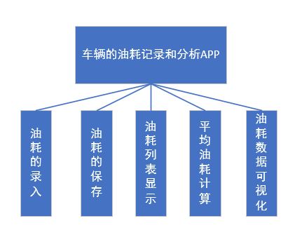
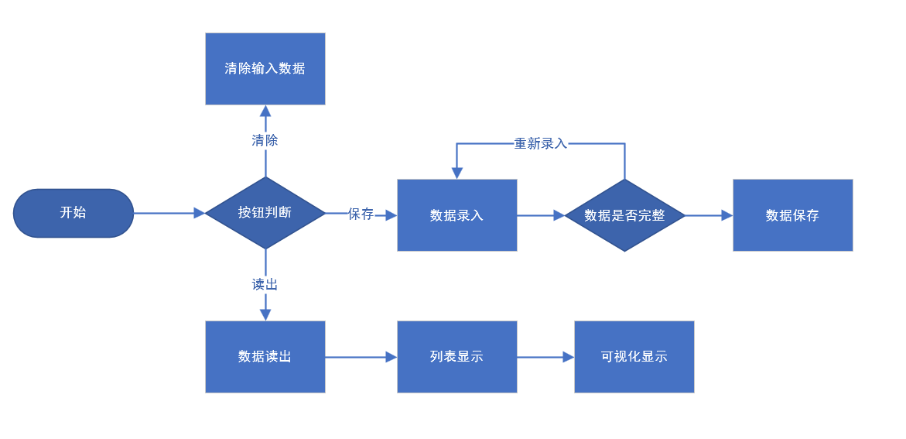
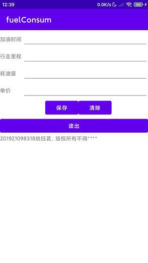
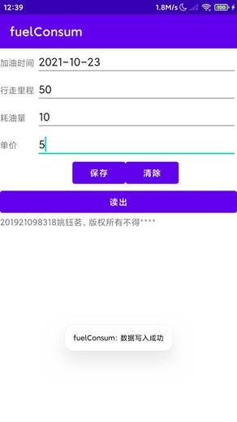
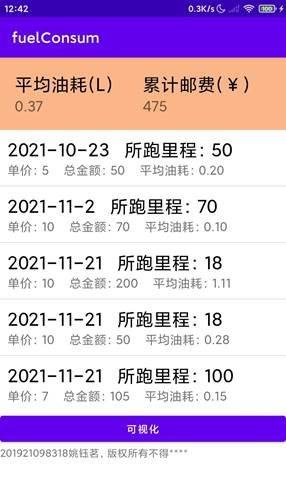
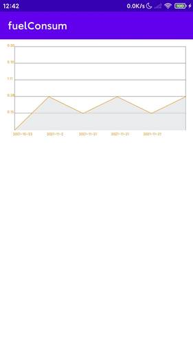

# README

**车辆的油耗记录和分析APP（1）**： 完成油耗的录入和保存。 完成油耗的录入和列表显示。包括有加油的金额、单价、所跑的里程和平均油耗。 具体算法和公式请自行解决。

**车辆的油耗记录和分析APP（2）**：对油耗进行统计分析 

1、总的平均油耗、总费用、总加油升数 

2、画出每次加油后的油耗曲线。 其余曲线也可以自己定义画出来。 要求：输入一次新的油价、里程和费用，曲线要能变动，就是画出新的曲线。

## 需求分析

车辆的油耗记录和分析APP：应该包括油耗信息的录入，油耗信息的保存，油耗信息读出并且列表显示，平均油耗的计算，总的平均油耗和总金额的计算，油耗数据的可视化等功能。

油耗app，功能模块如下图：

- 油耗信息的录入：油耗的相关信息包括油价、里程、加油数、加油时间，输入框输入；
- 油耗信息的保存：油耗的相关信息以文件的形式本地保存；
- 油耗信息读出并且列表显示：本地保存的油耗相关信息读出，并且以列表的形式显示；
- 平均油耗的计算：计算每条信息的平均油耗；
- 总的平均油耗和总金额的计算：计算总的平均油耗和消费的总金额；
- 油耗数据的可视化：时间和平均油耗的数据可视化。

车辆的油耗记录和分析APP整体流程图：

- 油耗信息的录入：输入框输入油耗的相关信息包括油价、里程、加油数、加油时间，其中日期的输入用日期选择框；
- 输入框数据清除：输入框的数据全修改为空；
- 油耗信息的保存：油耗的相关信息以文件的形式本地保存，保存之前判断输入是否合法，是否完整，同一种数据保存到同一个文件名中，用空格隔开；
- 油耗信息读出并且列表显示：本地保存的油耗相关信息读出，用空格分隔数据读出为数组，相关的数据以列表的形式显示；
- 平均油耗的计算：计算每条信息的平均油耗，后保存到文件中（消耗掉的油量/行驶里程=每公里油耗）；
- 总的平均油耗和总金额的计算：计算总的平均油耗和消费的总金额（ 总平均油耗=每条的平均油耗/n， 总金额=每次的相加（油耗的单价*耗油量） ）；
- 油耗数据的可视化：以折线图的形式展示时间-平均油耗的数据可视化，可以反应出不同的时间段里的油耗区别。

## 界面分析

Activity_main.xml:

输入数据后，按保存按钮数据可以保存到本地文件中。按下读出数据按钮，页面跳转，油耗信息列表显示。按下可视化按钮，页面跳转，折线图绘制。

Show.xml, lineShow.xml:

